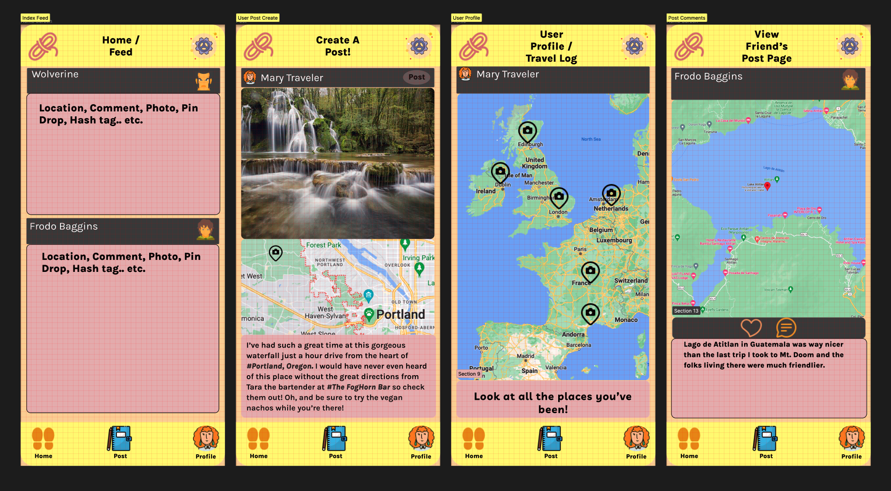

# ShoeString
## a MERN app 
### by Zach Sykes and Corey Loftus

## MVP Features
- index feed of User Posts, displayed in chrono order
- users can create Posts with:
    - title, body, images, tags
- User Profile page displays a map w/ pins of all locations User has posted about
- Users can add comments to posts
- Users can add Likes to posts

## Stretch Features
- Tags show page
    - view trending / most used Tags
- Comments
    - User Profile page displays all comments a User has made, with links to the original post
- Map
    - a grand Map for the entire site - displays pins for every location that all users have posted about

## Wireframe Images

## Assignments / Responsibilities
Zach is primarily responsible for the Frontend of the app.
Corey is primarily repsonsible for the Backend of the app.

## User Flow Map

## User Stories
